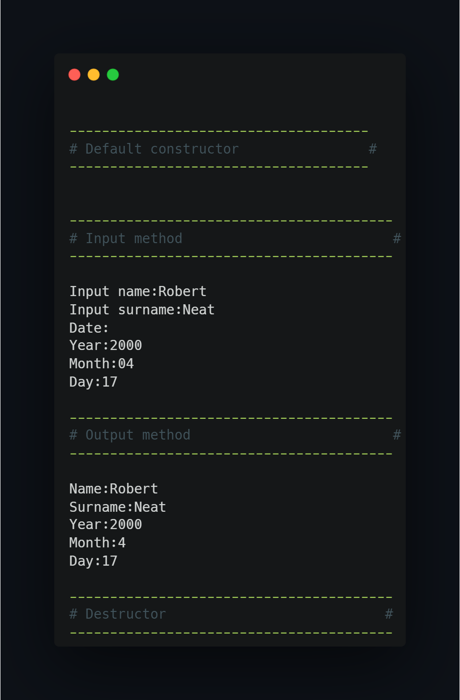

## What project do?
___

Project is an example of class wc hich utilizes overloaded constructors, private fields, overloaded methods and destructor.

Program create pointer to an object and uses arrow operator to call methods of the class to perform actions.

## How to use?
___
Just import project to CodeBlocks and compile/run. If you wish you could use another environment by using only main.cpp file.

<!--https://banner.godori.dev/-->
<!--https://shields.io/-->
<!--https://carbon.now.sh/-->